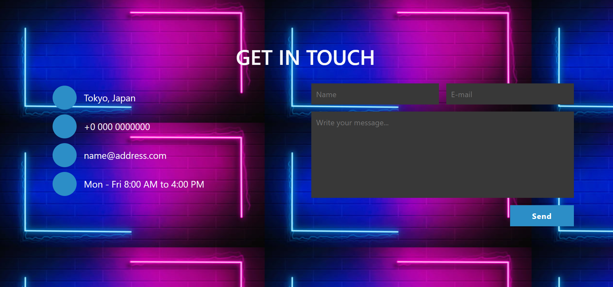
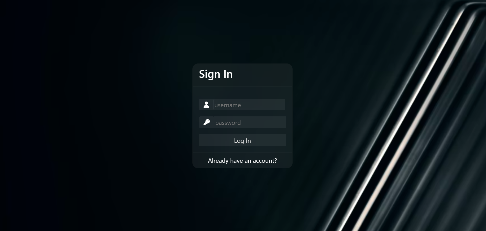
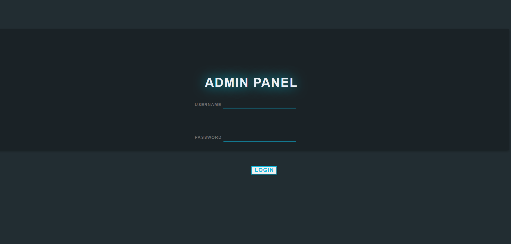
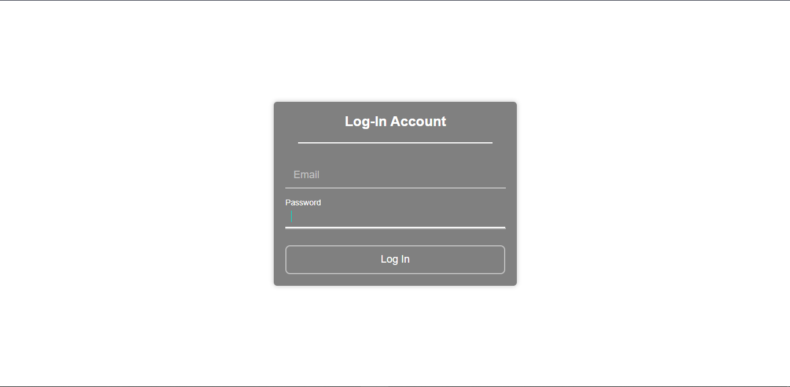
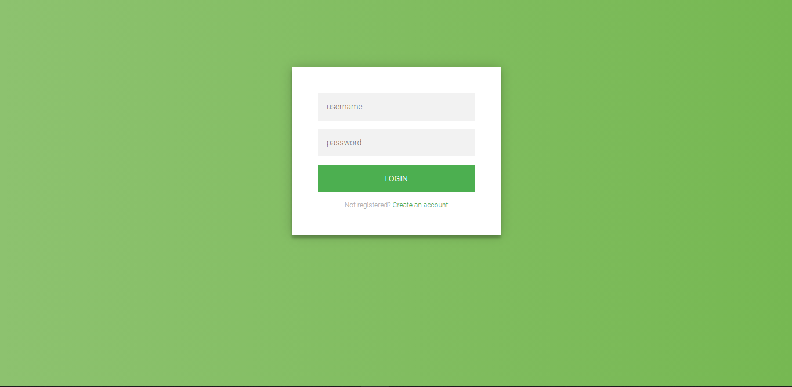
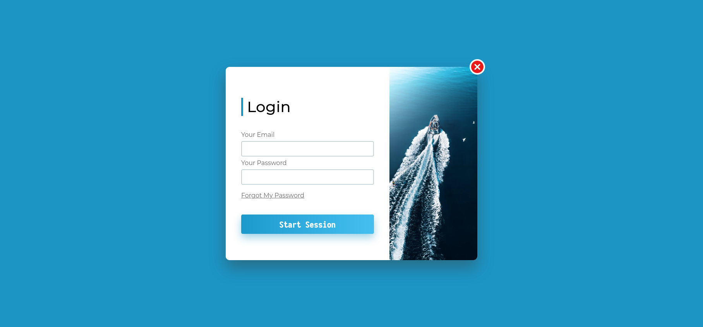

<h1 align="center">
   :star2: Login Signup Templates :star2:
</h1>
<p align="center">
   
   
   
</p>

# About :zap:
Collection of Login Signup Templates.

# How to Contribute :dart:

- FIrst fork this project.

- Clone your forked version ```git clone git@github.com:<YOUR-USERNAME>/Login-Signup-Templates.git```
 and make changes.

- Commit your changes (write a short descriptive message of what you have done).

- Push your changes to your forked version.

- Go to original project on GitHub & Create a Pull Request.

## :bangbang:  IMPORTANT :bangbang:
<ul>
  <li>Add your project folder into folder pages</li>
  <li><h3>:chains: Project Folder Structure :chains:</h3>
    <ul>
      <li>index.html</li>
      <liJS folder</li>
      <li>CSS folder</li>
      <li>Image</li>
      <li>SS of your work</li>
    </ul>
  </li>
  <li>Add your userdata into Data/pages.json folder</li>
  
  
```
  {
        "id": 1,
        "name": "Your clone Page Name",
        "description" : "This is the login page of this this ...",
        "img": "",
        "githuburl": "",
        "liveurl": "",
        "userData": {
            "nameofcreator": "",
            "githuburl": "",
            "linkedinurl": "",
            "portfolio": "",
            "email": "",
            "twitter": "",
            "mail": ""
        }
    }
  ```
# :fire: Contributors :fire:

<a href="https://github.com/NishikantaRay/Login-Signup-Templates/graphs/contributors">
  
</a>

Made with [contributors-img](https://contrib.rocks).
<!-- ## Demo
















 -->
